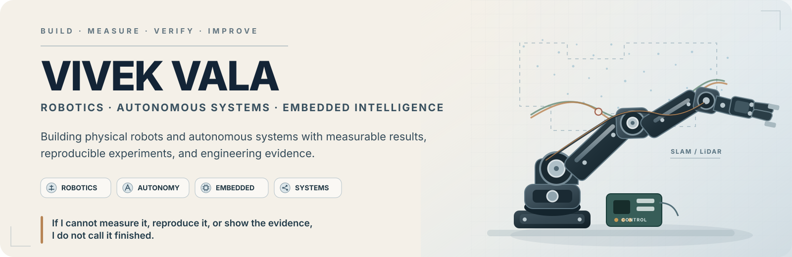

  

[**Portfolio**](https://vivek-vala-portfolio.vercel.app/) ·
[**Projects**](https://github.com/VivekVRobo?tab=repositories) ·
[**Open Source**](https://github.com/manankharwar/fusioncore/pull/96)

---

## What I build

**🤖 Physical Robotics**  
Real robotic systems across gesture control, servo actuation, kinematics, calibration, sensing, and embedded control.

**🗺️ Autonomy**  
ROS 2 SLAM and navigation workflows built around ground truth, trajectory evaluation, repeatability, and reproducible runtime evidence.

**🧠 Intelligent Systems**  
Local first autonomous execution with planning, authority control, durable missions, recovery, and verification.

**⚙️ Systems Engineering**  
C++, networking, concurrency, CI, embedded systems, robotics infrastructure, and evidence driven software engineering.

---

## Featured Engineering

### 01 · 🤖 Gesture Controlled Robotic Arm

**Physical hardware proof**

Wearable MPU6050 gesture control over nRF24L01 driving a real multi joint robotic arm through Arduino and PCA9685 servo control.

**Stack:** `Arduino` · `C++` · `MPU6050` · `nRF24L01` · `PCA9685`

**Evidence:** real physical actuation and bench evidence are published with the project.

[**Explore the robotic arm →**](https://github.com/VivekVRobo/gesture-controlled-robotic-arm)

### 02 · 🗺️ ROS 2 SLAM

**Localization and reproducible autonomy**

A ROS 2 SLAM stack designed around simulator ground truth, trajectory metrics, loop closure measurement, rosbag regression, and reproducible evidence.

**Stack:** `ROS 2` · `Gazebo` · `LiDAR` · `Python` · `SLAM Toolbox`

**Evidence:** static contracts and ROS build validation are verified. The full end to end runtime benchmark remains an active proof target.

[**Explore the SLAM system →**](https://github.com/VivekVRobo/slam-robot-ros2)

### 03 · 🧠 Universal Brain

**Autonomous systems architecture**

A local first executive runtime where planning, tool access, authority, durable state, recovery, and verification are explicit system concerns.

**Stack:** `Planning` · `Task DAGs` · `Authority` · `Recovery` · `Verification`

**Evidence:** architecture and automated engineering checkpoints are verified. Real environment endurance evidence is still in progress.

[**Explore Universal Brain →**](https://github.com/VivekVRobo/universal-brain)

---

## Engineering Evidence

I keep technical claims at the same level as the evidence behind them.

| System | Current evidence | Status |
| --- | --- | :---: |
| **Gesture Controlled Robotic Arm** | Real physical actuation and bench evidence | ✅ Verified |
| **ROS 2 SLAM stack** | Build, regression, trajectory evaluation, loop closure and evidence infrastructure | ✅ Verified |
| **ROS 2 runtime benchmark** | End to end Gazebo ground truth ATE and RPE bundle | ◐ In progress |
| **3 DOF Robotic Arm** | Analytic FK and IK, Cartesian planning, servo mapping and numerical validation | ✅ Verified |
| **3 DOF physical accuracy** | Repeated measured endpoint accuracy and repeatability | ◐ Pending |
| **Custom PCB Motor Driver** | KiCad design, current analysis and thermal engineering work | ✅ Design evidence |
| **PCB hardware validation** | Fabrication and instrumented bench testing | ◐ Pending |
| **HTTP Server From Scratch** | Linux and Windows CI, parser, routing and bounded concurrency | ✅ Verified |
| **Universal Brain** | Architecture, automated tests and engineering checkpoints | ✅ Verified |
| **Universal Brain endurance** | Long duration real environment operational evidence | ◐ In progress |

---

## Open Source

### FusionCore · Merged Upstream ✅

[**PR #96 · GNSS TF and frame validation**](https://github.com/manankharwar/fusioncore/pull/96)

This contribution fixed false GNSS TF warnings caused by assuming a fixed frame, improved configurable and message derived frame resolution, updated lever arm lookup behavior, and added focused regression coverage.

The work was reviewed and merged upstream. It is the strongest external validation on this profile today.

**External contribution record:** `01` · **FusionCore** · GNSS TF and frame validation · **MERGED**

More entries will be added only when contributions are genuinely accepted upstream.

---

## More Engineering Work

**[3dof robotic arm](https://github.com/VivekVRobo/3dof-robotic-arm)**  
Analytic FK and IK, Cartesian planning, servo mapping, and validation tooling. Numerical validation is complete; physical endpoint accuracy is still pending.

**[custom pcb motor driver](https://github.com/VivekVRobo/custom-pcb-motor-driver)**  
DRV8848 motor driver design, current and thermal modelling, and KiCad workflow. Engineering and CAD evidence are available; fabrication and bench validation remain pending.

**[http server from scratch](https://github.com/VivekVRobo/http-server-from-scratch)**  
C++20 raw sockets, HTTP parsing, secure static files, bounded concurrency, and Linux epoll. Linux and Windows CI are verified; controlled performance measurements remain pending.

**[line following robot](https://github.com/VivekVRobo/line-following-robot)**  
PID control, deterministic simulation, telemetry, and robustness evaluation.

**[cv object sorter](https://github.com/VivekVRobo/cv-object-sorter)**  
OpenCV perception to decision to actuation pipeline with deterministic software evaluation tooling.

---

## Engineering Stack

**Robotics and autonomy**  
`ROS 2` · `Gazebo` · `SLAM` · `TF` · `Localization` · `Navigation` · `Kinematics` · `Trajectory Evaluation`

**Embedded systems and controls**  
`C` · `C++` · `Arduino` · `PCA9685` · `Sensors` · `Serial Protocols` · `Servo Control` · `Motor Control` · `Watchdogs`

**Perception and electronics**  
`OpenCV` · `MediaPipe` · `LiDAR` · `Calibration` · `KiCad` · `Motor Drivers` · `Current Modelling` · `Thermal Modelling`

**Systems and software**  
`C++20` · `Linux` · `Raw Sockets` · `HTTP/1.1` · `epoll` · `Concurrency` · `CMake` · `Python` · `GitHub Actions` · `CI`

**Intelligent systems**  
`Local Models` · `Agent Systems` · `Tool Execution` · `Persistent State` · `Verification` · `Recovery`

---

## Engineering Principles

### Evidence before claims

Simulation stays simulation. Software validation is not physical validation. Physical claims require physical measurements or direct hardware evidence.

### Reproducibility

Important experiments should preserve the commit, environment, configuration, inputs, raw artifacts, metrics, and failure cases needed to reconstruct what happened.

### Safety and authority

Autonomous execution should have explicit boundaries around what a system may do, what requires approval, what can be reversed, and how failures are recovered.

### Failure visibility

A failed experiment is useful engineering evidence when the conditions, observations, and failure mode are preserved clearly.

---

## Current Proof Priorities

1. Publish a genuine end to end Gazebo SLAM benchmark bundle with ground truth, estimated trajectory, ATE, RPE, loop closure evidence, configuration, and reproducible artifacts.
2. Measure real endpoint accuracy and repeatability on the 3 DOF robotic arm.
3. Fabricate and bench test the motor driver PCB.
4. Publish controlled performance measurements for the C++ HTTP server.
5. Continue contributing focused fixes and tests to external robotics and software projects.

---

## Build · Measure · Verify · Improve

I am interested in robotics, autonomous systems, ROS 2, embedded systems, computer vision, controls, physical AI, and systems engineering work where implementation can be backed by reproducible evidence.

[**Portfolio**](https://vivek-vala-portfolio.vercel.app/) ·
[**GitHub Projects**](https://github.com/VivekVRobo?tab=repositories) ·
[**FusionCore Contribution**](https://github.com/manankharwar/fusioncore/pull/96)

