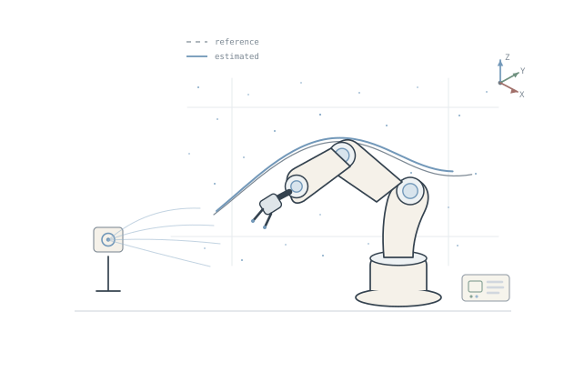
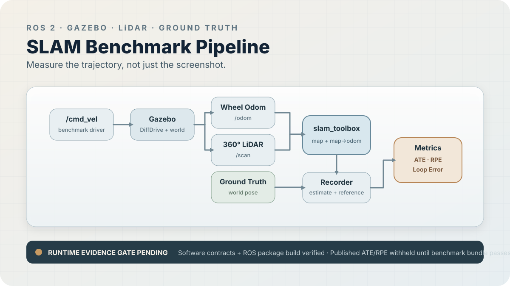
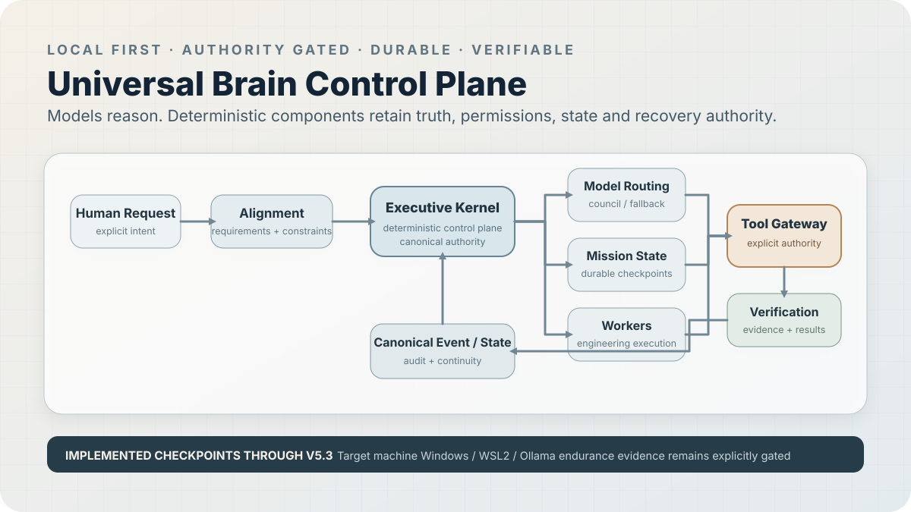

# Vivek Vala

### Robotics · Autonomous Systems · Embedded Intelligence

Building physical robots and autonomous systems where claims are backed by **code, measurements, and real hardware**.

Focused on **SLAM, robotic manipulation, embedded autonomy, and reliable autonomous systems**.

**Evidence over hype.**

[**Portfolio**](https://vivek-vala-portfolio.vercel.app/) · [**Contact**](https://vivek-vala-portfolio.vercel.app/#contact) · [**Open Source**](https://github.com/manankharwar/fusioncore/pull/96)

 

---

## Current Work

**ROS 2 / SLAM**  
Ground truth benchmarking, trajectory evaluation, loop closure analysis, and reproducible evidence.

**Robotic Manipulation**  
Physical control, calibration, gesture teleoperation, endpoint accuracy, and repeatability.

**Autonomous Systems**  
Durable execution, explicit authority, recovery, verification, and local first orchestration.

**Open Source**  
Focused upstream contributions where the work can be reviewed, tested, and accepted.

---

## Featured Engineering

Three systems, one standard: **implementation, measurable evidence, and explicit proof boundaries.**

### 01 · Gesture Controlled Robotic Arm

  

**Wearable IMU control over 2.4 GHz RF driving a physical multi joint robotic arm.**

`C++` · `Arduino` · `MPU6050` · `nRF24L01` · `PCA9685`

**Evidence:** Physical actuation ✅ · Firmware verification ✅ · Latency and repeatability ◐ Pending

[**Repository →**](https://github.com/VivekVRobo/gesture-controlled-robotic-arm) · [**Actuation video →**](https://github.com/VivekVRobo/gesture-controlled-robotic-arm/blob/main/docs/media/physical_actuation_evidence.mp4) · [**Hardware bench →**](https://github.com/VivekVRobo/gesture-controlled-robotic-arm/blob/main/docs/images/robotic_arm_hardware_bench.jpg) · [**Verification tests →**](https://github.com/VivekVRobo/gesture-controlled-robotic-arm/blob/main/tests/test_firmware_motion_engine.py)

---

### 02 · ROS 2 SLAM Benchmarking

  

**A reproducibility first SLAM stack that evaluates estimated motion against independent Gazebo ground truth.**

`ROS 2` · `Gazebo` · `LiDAR` · `SLAM Toolbox` · `ATE` · `RPE`

**Evidence:** Package and CI contracts ✅ · Benchmark tooling ✅ · Published runtime ATE / RPE ◐ Pending

[**Repository →**](https://github.com/VivekVRobo/slam-robot-ros2) · [**Benchmark runbook →**](https://github.com/VivekVRobo/slam-robot-ros2/blob/main/docs/BENCHMARK_EVIDENCE_RUNBOOK.md) · [**Trajectory evaluator →**](https://github.com/VivekVRobo/slam-robot-ros2/blob/main/tools/trajectory_metrics.py) · [**Release gate →**](https://github.com/VivekVRobo/slam-robot-ros2/blob/main/docs/RELEASE_READINESS.md)

---

### 03 · Universal Brain

  

**A local first autonomous execution system that separates model reasoning from persistent authority, state, recovery, and verification.**

`Python` · `Model Routing` · `Durable Missions` · `Authority Gates` · `Verification`

**Evidence:** V5.3 verification record ✅ · Cross platform evidence harness ✅ · Windows / WSL2 target proof ◐ Pending

[**Repository →**](https://github.com/VivekVRobo/universal-brain) · [**Architecture →**](https://github.com/VivekVRobo/universal-brain/blob/main/docs/architecture/SYSTEM_ARCHITECTURE.md) · [**Verification record →**](https://github.com/VivekVRobo/universal-brain/blob/main/docs/testing/ENGINEERING_AGENCY_V53_VERIFICATION.md) · [**Threat model →**](https://github.com/VivekVRobo/universal-brain/blob/main/docs/security/THREAT_MODEL.md)

---

## Proof Ledger

A compact view of what is **verified now** and what is still explicitly gated.

| System | Current proof | Boundary |
| --- | --- | --- |
| **Robotic Arm** | Physical actuation, hardware bench, firmware tests ✅ | Latency and repeatability still need measurement |
| **ROS 2 SLAM** | Package contracts, evaluation and benchmark tooling ✅ | Runtime ATE / RPE evidence still pending |
| **Universal Brain** | V5.3 verification record and cross platform validation harness ✅ | Windows / WSL2 target endurance still pending |
| **Open Source** | FusionCore PR #96 merged upstream ✅ | New entries only after upstream acceptance |

---

## Open Source

### FusionCore · PR #96 · Merged Upstream ✅

**ROS 2 GNSS frame resolution and TF validation**

I fixed a real frame mismatch in FusionCore where GNSS validation could assume `gnss_link` even when a driver published another frame such as `gps`.

**What changed**

- added configurable `gnss.frame_id` support
- resolved the active GNSS frame as **configured override → message header → `gnss_link` fallback**
- used the resolved frame for TF validation and NavSatFix lever arm lookup
- added focused regression coverage for override, message, and fallback precedence
- kept the change scoped to the reported GNSS frame issue

**Upstream result:** merged **September 8, 2026** · 5 files changed · accepted into the original FusionCore repository

[**View merged PR #96 →**](https://github.com/manankharwar/fusioncore/pull/96) · [**Original issue #81 →**](https://github.com/manankharwar/fusioncore/issues/81) · [**FusionCore repository →**](https://github.com/manankharwar/fusioncore)

> Future contributions appear here only after they are accepted upstream.

---

## Engineering Stack

### Robotics

    

### Embedded

    

### Perception

   

### Systems

    

### Intelligence

   

---

## Research / Systems Interests

`ROS 2` · `SLAM` · `Localization` · `Controls` · `Embedded Robotics` · `Computer Vision` · `Sensor Fusion` · `Physical AI` · `Autonomous Agents` · `Reliable Systems`

---

## GitHub Activity

  

The activity graph is secondary to the engineering evidence above. Projects, accepted upstream work, tests, measurements, and real hardware remain the primary signals.

---

## Building / Research / Collaboration

I am interested in work across `Robotics`, `ROS 2`, `Autonomy`, `Embedded Systems`, `Controls`, `Computer Vision`, `Physical AI`, and `Systems Engineering`.

  <a href="https://vivek-vala-portfolio.vercel.app/"><strong>Portfolio</strong></a> ·
  <a href="https://github.com/VivekVRobo?tab=repositories"><strong>Projects</strong></a> ·
  <a href="https://github.com/manankharwar/fusioncore/pull/96"><strong>Open Source</strong></a> ·
  <a href="https://vivek-vala-portfolio.vercel.app/#contact"><strong>Contact</strong></a>

<strong>Build · Measure · Verify · Improve</strong>

